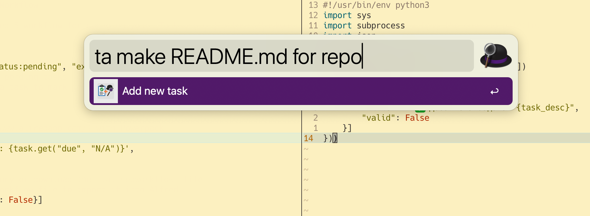
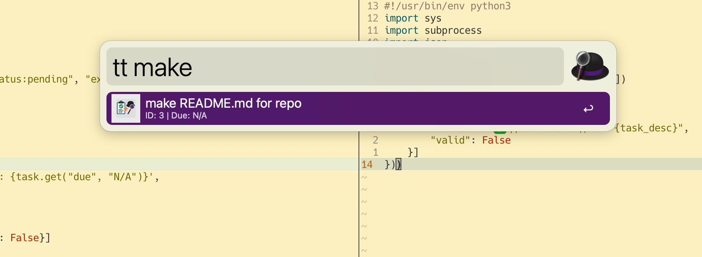

# Alfred Taskwarrior Workflow

🎩 A lightweight Alfred 5 workflow for managing your [Taskwarrior](https://taskwarrior.org/) tasks directly from the command palette.

## ✨ Features

- `ta <task>` — Quickly add a new task
- `tt` — List
  - Press `Enter` on a task to mark it as **done**

## ⚙️ Requirements

- [Alfred 5](https://www.alfredapp.com/) with Powerpack
- [Taskwarrior](https://taskwarrior.org/download/) installed and configured

## 🚀 Installation

1. Clone this repository or download the `.alfredworkflow` file
2. Double-click the workflow file to import it into Alfred
3. Ready to go 🎉

## 📸 Preview

## 📸 Screenshots

| Action                       | Screenshot                                                       | Description                                                                                 |
|------------------------------|------------------------------------------------------------------|---------------------------------------------------------------------------------------------|
| **Add Task (`ta`)**          |                             | Run `ta <task>` (e.g. `ta buy milk`)—Alfred adds a new Taskwarrior task and shows a ✔️.     |
| **Find & Complete (`tt`)**   |             | Run `tt` then type (or have Alfred filter) “read”—Alfred lists matching tasks; Enter marks complete. |

## 🧠 Implementation Notes

This workflow uses two Python scripts:

- `task_add.py`: accepts a task description and runs `task add <description>`
- `tasks.py`: fetches pending tasks using `task status:pending export`, displays them, and marks them done on selection
- `task_complete.py`: completed selected task

## 📁 Project Structure

```
workflow/
├── icon.png # Workflow icon
├── task_add.py # Add task
├── tasks.py # Show
└── task_complete.py # Complete
└── info.plist # Alfred-generated metadata
```

## 📝 License
